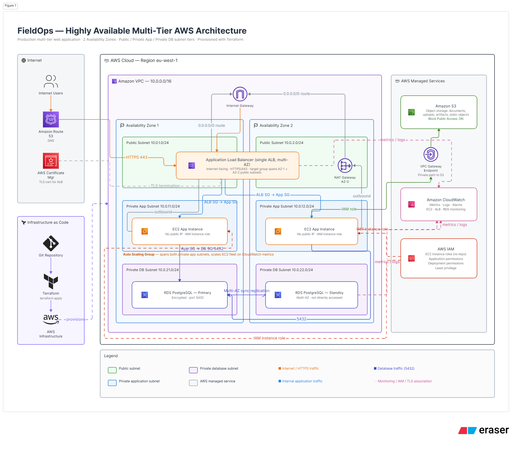

# Architecture

## 1. Architecture Overview

This project implements a production-oriented AWS multi-tier architecture using Terraform.

The architecture separates the workload into distinct network and application tiers:

- Public networking for internet-facing components
- Private application subnets for EC2 workloads
- Private database subnets for PostgreSQL
- Application Load Balancer for traffic distribution
- EC2 Auto Scaling Group for application compute
- Docker containers for application deployment
- Amazon ECR for container image storage
- Amazon RDS PostgreSQL for persistent data
- AWS Secrets Manager for database credentials
- AWS Systems Manager Session Manager for administrative access
- NAT Gateway for controlled outbound connectivity
- Amazon S3 VPC endpoint for private S3 access

The architecture is designed for high availability across multiple Availability Zones, with the application tier distributed across multiple EC2 instances behind an Application Load Balancer.

The infrastructure is defined entirely as code using Terraform.

---

## 2. Architecture Diagram



### Logical Architecture

```text
                         Internet
                            |
                            v
                  +---------------------+
                  | Internet Gateway     |
                  +----------+----------+
                             |
                             v
              +---------------------------+
              |      Public Subnets       |
              |                           |
              | Application Load Balancer |
              +-------------+-------------+
                            |
                     Target Group :8080
                            |
              +-------------+-------------+
              |                           |
              v                           v
      +---------------+           +---------------+
      | Private App   |           | Private App   |
      | Subnet - AZ1  |           | Subnet - AZ2  |
      |               |           |               |
      | EC2 + Docker  |           | EC2 + Docker  |
      | FastAPI       |           | FastAPI       |
      +-------+-------+           +-------+-------+
              |                           |
              +-------------+-------------+
                            |
                            v
                 +----------------------+
                 | Private DB Subnets   |
                 |                      |
                 | RDS PostgreSQL       |
                 +----------------------+

Private application outbound traffic
                    |
                    v
              NAT Gateway
                    |
                    v
             Internet Gateway

Private S3 access
                    |
                    v
             S3 VPC Endpoint


### 2a. Security Group Traffic Model

Internet
   |
   | HTTP :80
   v
ALB Security Group
   |
   | TCP :8080
   v
Application Security Group
   |
   | TCP :5432
   v
Database Security Group


## 3. AWS Services

| Service | Purpose |
|---|---|
| Amazon VPC | Isolated network environment |
| Application Load Balancer | Internet-facing application entry point and traffic distribution |
| EC2 Auto Scaling Group | Highly available application compute |
| Amazon ECR | Private container image registry |
| Docker | Application container runtime |
| Amazon RDS PostgreSQL | Managed relational database |
| AWS Secrets Manager | Database credential storage |
| AWS Systems Manager | Secure administrative access |
| NAT Gateway | Controlled outbound connectivity |
| S3 VPC Endpoint | Private S3 connectivity |
| IAM | Identity and access management |

## 4. Network Segmentation

The architecture separates resources into three logical tiers:

### Public Tier

The public tier contains the internet-facing Application Load Balancer.

### Application Tier

The application tier contains EC2 instances managed by an Auto Scaling Group.

The instances are deployed in private subnets and run the containerized FastAPI application.

### Database Tier

The database tier contains Amazon RDS PostgreSQL in private database subnets.

The database is not directly accessible from the Internet.

---

## 5. Application Traffic Flow

```text
Internet
   |
   v
Application Load Balancer
   |
   v
Target Group :8080
   |
   +-------------------+
   |                   |
   v                   v
EC2 / Docker       EC2 / Docker
   |                   |
   +---------+---------+
             |
             v
       RDS PostgreSQL


## 6. Key Architecture Decisions

### Application instances in private subnets

EC2 instances are deployed in private subnets to prevent direct
internet exposure. Internet-facing traffic is terminated at the
Application Load Balancer.

### Application Load Balancer

The ALB provides a single public entry point and distributes traffic
across multiple application instances.

### Auto Scaling Group

The application tier uses an Auto Scaling Group to maintain
availability and support horizontal scaling.

### RDS PostgreSQL

Amazon RDS is used instead of self-managed PostgreSQL to reduce
operational overhead associated with database administration,
patching, backups, and infrastructure management.

### Secrets Manager

Database credentials are stored in AWS Secrets Manager rather than
being embedded in Terraform configuration, application code, or
container images.

### Systems Manager Session Manager

Session Manager provides administrative access without requiring
public IP addresses or inbound SSH access to application instances.

## 7. Architecture Trade-offs

### EC2 + Auto Scaling Group vs ECS/Fargate

EC2 with an Auto Scaling Group was selected for this implementation to demonstrate:

- EC2 lifecycle management
- Launch Templates
- User data/bootstrapping
- Auto Scaling
- Systems Manager
- Docker runtime management

ECS/Fargate would reduce infrastructure management overhead and is identified as a future evolution of the architecture.

### NAT Gateway

A NAT Gateway provides controlled outbound connectivity for private application instances.

The trade-off is cost. For a portfolio environment, NAT Gateway charges can be significant relative to the workload size.

For this reason, the infrastructure is destroyed when not actively being demonstrated.

### RDS PostgreSQL

RDS was selected instead of running PostgreSQL directly on EC2 because it provides managed database capabilities and reduces operational overhead.

### Application Load Balancer

An ALB provides a stable public entry point while keeping the application instances private.